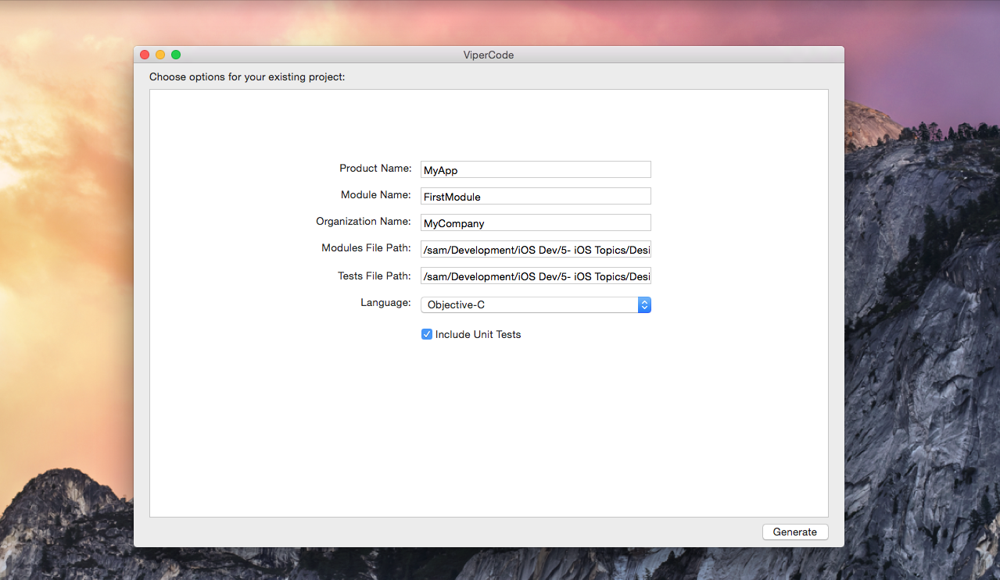

<h3 align="center">
    
    <br />
  </a>
</h3>

# ViperCode
============


[](https://github.com/fastlane/produce/blob/master/LICENSE)

###### A simple OS X App for generate VIPER modules's skeleton to use them in your Objective-C/Swift projects.

Get in contact with the developer on Twitter: [@same7mabrouk](https://twitter.com/same7mabrouk)

# What is VIPER?
VIPER is an application of Clean Architecture to iOS apps. The word VIPER is a backronym for View, Interactor, Presenter, Entity, and Routing. Clean Architecture divides an app’s logical structure into distinct layers of responsibility. This makes it easier to isolate dependencies (e.g. your database) and to test the interactions at the boundaries between layers:


- Know more about VIPER through this post http://www.objc.io/issue-13/viper.html

# Features

- **Generate** new VIPER modules in Swift and Objective-C
- **Generate** new VIPER modules's unit tests for Swift and Objective-C
- **Friendly UI** ViperCode module generation UI is similar to Xcode UI.
- **Good bye Ruby gems** No need to install Ruby gems, ViperCode is native OS X app. 

# VIPER files structure
```bash
.objc
+-- DataManager
|   +-- VIPERDataManager.h
|   +-- VIPERDataManager.m
+-- Interactor
|   +-- VIPERInteractor.h
|   +-- VIPERInteractor.m
+-- Presenter
|   +-- VIPERPresenter.h
|   +-- VIPERPresenter.m
+-- ViewController
|   +-- VIPERViewController.h
|   +-- VIPERViewController.m
+-- WireFrame
|   +-- VIPERWireFrame.h
|   +-- VIPERWireFrame.m
+-- Protocols
|   +-- VIPERProtocols.h
.objc tests
+-- Interactor
|   +-- VIPERInteractorTests.m
+-- Presenter
|   +-- VIPERPresenterTests.m
+-- ViewController
|   +-- VIPERViewControllerTests.m
+-- WireFrame
|   +-- VIPERWireFrameTests.m
.swift
+-- DataManager
|   +-- VIPERDataManager.swift
+-- Interactor
|   +-- VIPERInteractor.swift
+-- Presenter
|   +-- VIPERPresenter.swift
+-- ViewController
|   +-- VIPERViewController.swift
+-- WireFrame
|   +-- VIPERWireFrame.swift
+-- Protocols
|   +-- VIPERProtocols.swift
.swift tests
+-- Interactor
|   +-- VIPERInteractorTests.swift
+-- Presenter
|   +-- VIPERPresenterTests.swift
+-- ViewController
|   +-- VIPERViewTests.swift
+-- WireFrame
|   +-- VIPERWireFrameTests.swift
```
# Installation
Just clone the Repo, then build it using xCode 7.2 or above on any Mac OS X 10.10 or above.

# Usage

## Generating new VIPER module

Please enter the VIPER module name and module path then click generate button.

And then the files structure will be automatically created. Don't forget to add this folder to your project dragging it into the XCode or Appcode inspector.

## Generating new VIPER module's unit tests

Please check "Include unit tests" option then enter the VIPER module name and tests file path then click generate button.

# Note: 
* Don't Forget to add dependencies used in the generated code (unit tests classes).

* Dependencies List:
	- OCMock: For objects mocking and dependency Injection.

Screenshot of the ViperCode OS X app.


# To DO
* Make ViperCode plugin in Xcode
* Add more VIPER templates in Swift and Objective-C

# Change Log
* Version 0.1
	- Added Default template
	- Support module generation for Swift and Objective-C
	
# Need help?
Please submit an issue on GitHub, or contact me directly at mabrouksameh@gmail.com

# License
This project is licensed under the terms of the MIT license. See the LICENSE file.

